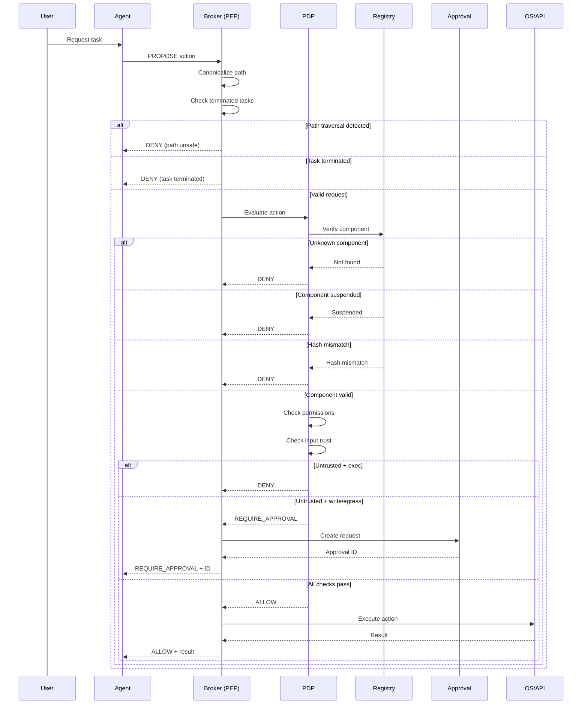
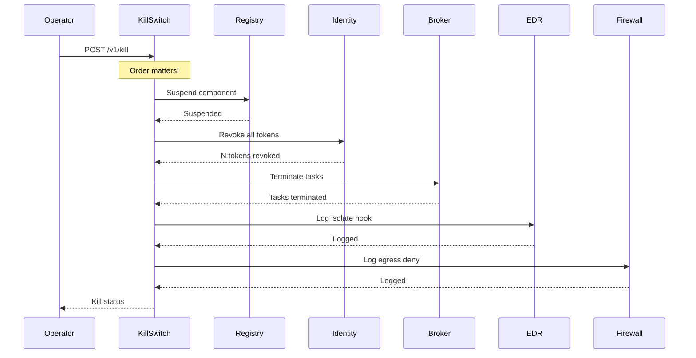

# 02 - How It Works

## Request Flow

Every action an agent wants to perform flows through the broker:



## Decision Outcomes

The PDP returns one of six possible decisions:

| Decision | Meaning | Action |
|----------|---------|--------|
| `ALLOW` | Action permitted | Broker executes the action |
| `DENY` | Action forbidden | Broker returns error |
| `REQUIRE_APPROVAL` | Human approval needed | Broker creates approval request |
| `ALLOW_IN_SANDBOX` | Permitted in isolation | Broker routes to sandbox |
| `ISSUE_EPHEMERAL_CREDENTIAL` | Short-lived credential issued | Broker provides scoped token |
| `TERMINATE_AND_REVOKE` | Emergency stop | Kill switch activated |

## Mediation Classes

Operations are classified by their latency and safety requirements:

### Class A — Fast Local (5s cache)

- **Operations**: `read_file` on approved roots
- **Behavior**: May use local cache to reduce latency
- **Cache TTL**: 5 seconds
- **Fallback**: Remote PDP if cache miss

```python
# Class A example
if within_approved_roots and cached_decision:
    return cached_decision  # Fast path
else:
    return await consult_pdp()  # Slow path
```

### Class B — Remote PDP (fail closed)

- **Operations**: `write_file`, `http_request`, `run_command`, `load_model`, `access_secret`
- **Behavior**: Always consult remote PDP
- **Timeout**: 5 seconds
- **Fallback**: DENY (fail closed)

```python
# Class B example
try:
    decision = await consult_pdp(timeout=5.0)
    return decision
except (Timeout, Unreachable):
    return DENY  # Fail closed
```

### Class C — Human Approval

- **Operations**: `delete_file`, `execute_privileged`, `modify_system`
- **Behavior**: Create approval request, wait for human
- **Timeout**: None (approval can take hours/days)
- **Fallback**: Queue if approval service degraded

```python
# Class C example
approval_id = await create_approval_request()
return REQUIRE_APPROVAL(approval_id)
# Agent must poll or wait for callback
```

### Class D — Offline Mode

- **Behavior**: Only Class A operations permitted
- **Use case**: Network outage, PDP unreachable
- **Fallback**: DENY everything except cached reads

## Input Trust Levels

Every action request includes an `input_trust` field:

| Level | Meaning | Allowed Operations |
|-------|---------|-------------------|
| `trusted` | From authenticated user | All (subject to policy) |
| `internal` | From internal systems | All (subject to policy) |
| `untrusted` | From external sources | Read only; write/exec denied |

### Untrusted Input Rules

```yaml
input_trust_rules:
  untrusted:
    # Untrusted + execution = DENY
    deny_operations:
      - run_command
      - execute_privileged
      - load_model
    
    # Untrusted + write/egress = REQUIRE_APPROVAL
    require_approval_operations:
      - write_file
      - http_request
```

## Kill Switch Flow

The kill switch performs an immediate, hard stop:



### Kill Switch Order

1. **Registry suspend** — Prevents new actions from being approved
2. **Token revocation** — Invalidates existing credentials
3. **Task termination** — Stops in-flight work
4. **EDR isolate** — Requests endpoint isolation
5. **Egress deny** — Blocks network access

## Latency Considerations

| Operation | Typical Latency | Acceptable Range |
|-----------|-----------------|------------------|
| Class A (cached) | < 1ms | < 5ms |
| Class A (uncached) | 5-10ms | < 50ms |
| Class B (normal) | 10-50ms | < 200ms |
| Class B (timeout) | 5000ms | N/A (DENY) |
| Class C (approval) | Hours-days | N/A (async) |

## Error Handling

All errors result in DENY (fail closed):

| Error | Decision | Reason |
|-------|----------|--------|
| Missing required field | DENY | Fail closed on ambiguity |
| Registry unreachable | DENY | Cannot verify component |
| PDP timeout | DENY | Cannot get decision |
| Unknown component | DENY | Not in registry |
| Hash mismatch | DENY | Capability integrity violated |
| Path traversal | DENY | Path safety violated |

## Telemetry

Every decision emits a telemetry event:

```json
{
  "event_id": "evt-abc123",
  "trace_id": "trace-xyz789",
  "timestamp": "2026-08-20T12:00:00Z",
  "event_type": "read_file_allowed",
  "user": "demo-user",
  "agent_identity": "agent:demo-coder",
  "task_id": "task-123",
  "operation": "read_file",
  "target": "/approved/workspace/data.txt",
  "decision": "ALLOW",
  "reason": "All policy checks passed"
}
```

Sensitive data is automatically redacted:
- Secrets (passwords, API keys, tokens)
- Chain of thought / reasoning
- Private keys and credentials
